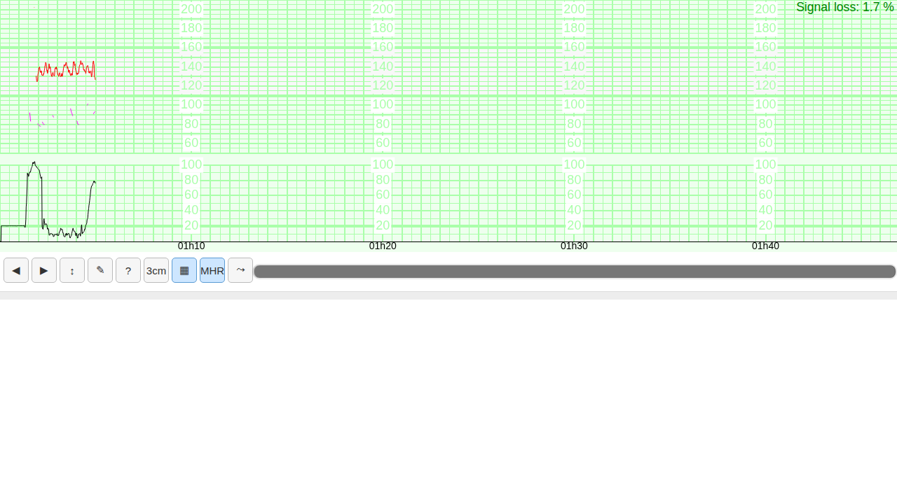
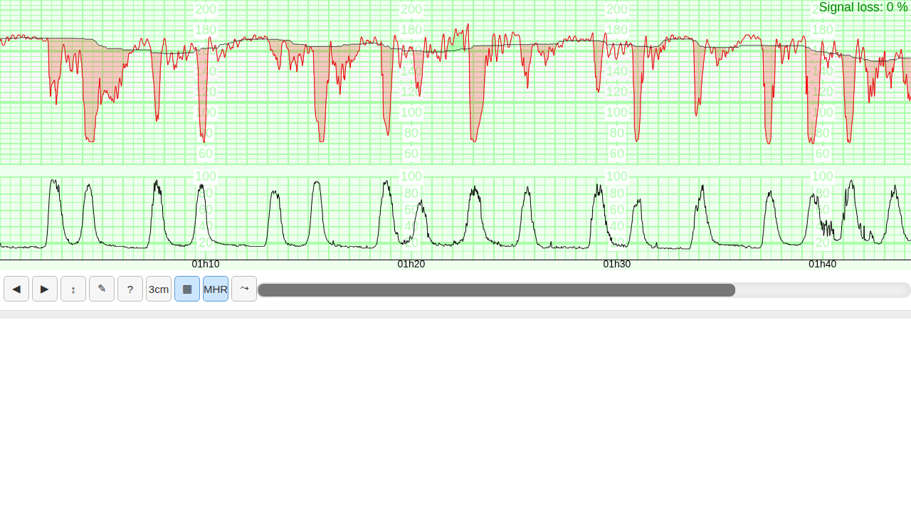
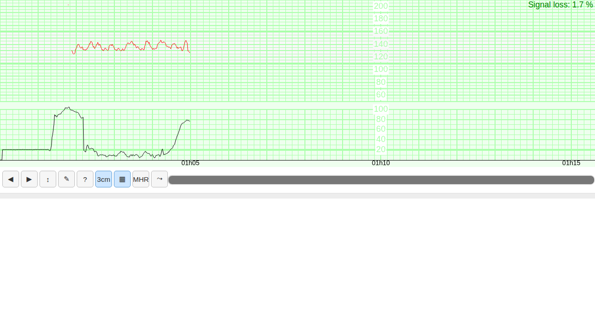

# FHRPY — progress & review guide

A single place to review the project state from the repository browser
(screenshots render inline on GitHub). Updated as the autonomous loop advances.

> Branch under development: **`dev`** (review here). `main` is updated only on an
> explicit, human-validated release.

## Roadmap status

| Étape | Scope | Status |
|------:|-------|--------|
| 0 | Project config, repo, issues, CI scaffolding | ✅ done |
| 1 | PHP-free web CTG viewer + Python wrapper | ✅ first cut (issue #2) |
| 3 | WMFB baseline + morphology (NumPy) | ✅ core (issue #4) + wired into viewer |
| — | File I/O `.fhr/.rcf/.rcfm/.dat` (MATLAB-parity) | ✅ done |
| 2 | False-signal detection (`fhrma-fs`) | 🔄 in progress |
| — | MATLAB parity via Octave docker | 🔜 |
| 4 | Full README + demos + AIM-CTG recruiting | 🔜 |
| 5 | MLOps real-time inference server | 🔜 |

Tests: run `pip install -e . && python3 -m pytest -q` (currently **28 passed, 2 skipped**).

## What the viewer looks like

**Default view** — CTG grid (FHR 50–210 top ⅔, TOCO 0–100 bottom ⅓), FHR1 red,
MHR magenta, TOCO filled, time ticks, signal-loss %:



**With real WMFB analysis** (`FHRViewer(path, analyze=True)`) — real baseline
following the FHR, **red deceleration zones** aligned with the **TOCO
contractions** below (physiologically coherent late/variable decels):



**3 cm/min paper speed** (`3cm` button):



## How to try it (when you have machine access)

```bash
git clone -b dev https://github.com/data-coeur/FHRPY.git && cd FHRPY
pip install -e .
```

```python
from fhrpy.viewer import FHRViewer

# 1) Inline in a notebook (VSCode / Colab):
FHRViewer("examples/example_recording.fhr", analyze=True)

# 2) Standalone offline HTML (no server, no PHP):
FHRViewer("examples/example_recording.fhr", analyze=True).to_html("demo.html")

# 3) Local server / new window (handy on Colab):
FHRViewer("examples/example_recording.fhr", analyze=True).serve()
```

```python
# Methods only (no viewer):
from fhrpy.io import read_fhr
from fhrpy.baseline import analyze
res = analyze(read_fhr("examples/example_recording.fhr"))
res["baseline"], res["accelerations"], res["decelerations"]
```

## Reviewing from the repo only

- **Code** lives under `fhrpy/` (`io/`, `preprocess/`, `baseline/`, `viewer/`,
  and soon `falsesignal/`, `training/`). Tests under `tests/`.
- **Design/spec notes** from reverse-engineering the MATLAB + JS sources:
  `docs/dev-notes/matlab_analysis.md`, `docs/dev-notes/viewer_analysis.md`.
- **Per-step discussion & screenshots**: GitHub issues #1–#8.
- **Open questions / what I need from you**: issue #8.

## Known limitations / to verify

- **MATLAB bit-parity** of the WMFB baseline is not yet validated (Octave docker
  harness pending — issue #4 / #8).
- ACC/DEC zones use the computed baseline; **contraction (TOCO) zones** need a
  dedicated detector (not in the MATLAB core).
- The viewer→Python live event callbacks are best-effort (in-page JS `on(...)`
  works today); see `viewer.py` TODO.
