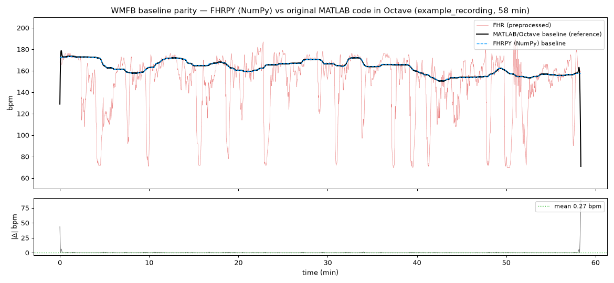
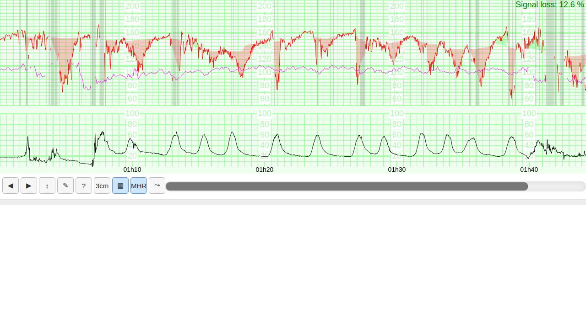

# FHRPY — progress & review guide

A single place to review the project state from the repository browser
(screenshots render inline on GitHub). Updated as the autonomous loop advances.

> Branch under development: **`dev`** (review here). `main` is updated only on an
> explicit, human-validated release.

## Roadmap status

| Étape | Scope | Status |
|------:|-------|--------|
| 0 | Project config, repo, issues, CI scaffolding | ✅ done |
| 1 | PHP-free web CTG viewer + Python wrapper | ✅ first cut (issue #2) |
| 3 | WMFB baseline + morphology (NumPy) | ✅ core (issue #4) + wired into viewer |
| — | File I/O `.fhr/.rcf/.rcfm/.dat` (MATLAB-parity) | ✅ done |
| 2 | False-signal detection (`fhrma-fs`) | ✅ ported + validated on held-out sets: DopMHRVal AUC 0.978 / ScalpVal AUC 0.966 (issue #3) |
| — | MATLAB parity via Octave docker | ✅ io/preprocess EXACT, WMFB ~0.27 bpm (issue #4) |
| 4 | Full README + demos + AIM-CTG recruiting | ✅ README done (AIM-CTG text + demos pending) |
| 5 | MLOps real-time inference server | ✅ stdlib HTTP server + Docker; real bench 12×3h in ~40 s on 4 cores (issue #6) |

**2026-09 — viewer options from OpenCTG** (issues #14–#25, branch `dev`): the
changes OpenCTG made in its vendored copy of the viewer came back upstream as
options with unchanged defaults — header length auto-detection and
`bytesPerSample` / `headerBytes`, `labels` (i18n), `delays` (per-sensor delay
compensation at display time), `timeZone` (IANA zone), the `£!` / `§` marker
conventions, `print()` options (cm/min, paper, header, footer), marker-editing
keys, the resize handle — plus a "follow live" control on the scrollbar, the MHR
toggle in the MHR colour, and pure white paper. `npm test` runs browser-free
unit tests of the viewer (`tests/js/`, Node only); `e2e/viewer_options.spec.ts`
builds its page from the current source. See `CHANGELOG.md`.

Install path verified: `pip install .` in a clean venv packages the web assets +
the FS model weights, and the viewer / WMFB / FS all work from the installed
package (so `pip install` + Colab work end-to-end). CI workflow is ready at
`.github/workflows/ci.yml` (pushed once the PAT has the `workflow` scope — #8).

Tests: run `pip install -e . && python3 -m pytest -q` (**43 passed, 4 skipped**;
add the Octave references via `bash docker/octave/run.sh` to enable the 15 parity
tests → 58 passed).

**MATLAB parity** (original FHRMA code run in Octave vs FHRPY NumPy): `read_fhr`
and `preprocess` are **bit-exact (0.0)**; the WMFB baseline matches to **0.27–0.49
bpm mean** (only start/end FIR edges differ). See the overlay below.



> Étape 2 note: the false-signal GRU inference is ported (verified to 1e-10 vs an
> independent reference) and runs without TensorFlow, but **dataset-level accuracy
> vs MATLAB is not yet validated** — it needs the exact `EvalFSForDataset` protocol
> and MHR handling (DopMHR dataset files censor MHR to 0). See issue #3.

## What the viewer looks like

**Default view** — CTG grid (FHR 50–210 top ⅔, TOCO 0–100 bottom ⅓), FHR1 red,
MHR magenta, TOCO filled, time ticks, signal-loss %:


**With real WMFB analysis** (`FHRViewer(path, analyze=True)`) — real baseline
following the FHR, **red deceleration zones** aligned with the **TOCO
contractions** below (physiologically coherent late/variable decels):


**False-signal detection** (`false_signals=True`) — grey `$URS` zones mark where
the Doppler FHR likely tracks the maternal HR, over baseline + decel zones:



**3 cm/min paper speed** (`3cm` button):


## How to try it (when you have machine access)

```bash
git clone -b dev https://github.com/data-coeur/FHRPY.git && cd FHRPY
pip install -e .
```

```python
from fhrpy.viewer import FHRViewer

# 1) Inline in a notebook (VSCode / Colab):
FHRViewer("examples/example_recording.fhr", analyze=True)

# 2) Standalone offline HTML (no server, no PHP):
FHRViewer("examples/example_recording.fhr", analyze=True).to_html("demo.html")

# 3) Local server / new window (handy on Colab):
FHRViewer("examples/example_recording.fhr", analyze=True).serve()
```

```python
# Methods only (no viewer):
from fhrpy.io import read_fhr
from fhrpy.baseline import analyze
res = analyze(read_fhr("examples/example_recording.fhr"))
res["baseline"], res["accelerations"], res["decelerations"]
```

## Reviewing from the repo only

- **Code** lives under `fhrpy/` (`io/`, `preprocess/`, `baseline/`, `viewer/`,
  and soon `falsesignal/`, `training/`). Tests under `tests/`.
- **Design/spec notes** from reverse-engineering the MATLAB + JS sources:
  `docs/dev-notes/matlab_analysis.md`, `docs/dev-notes/viewer_analysis.md`.
- **Per-step discussion & screenshots**: GitHub issues #1–#8.
- **Open questions / what I need from you**: issue #8.

## Known limitations / to verify

- **MATLAB bit-parity** of the WMFB baseline is not yet validated (Octave docker
  harness pending — issue #4 / #8).
- ACC/DEC zones use the computed baseline; **contraction (TOCO) zones** need a
  dedicated detector (not in the MATLAB core).
- The viewer→Python live event callbacks are best-effort (in-page JS `on(...)`
  works today); see `viewer.py` TODO.
